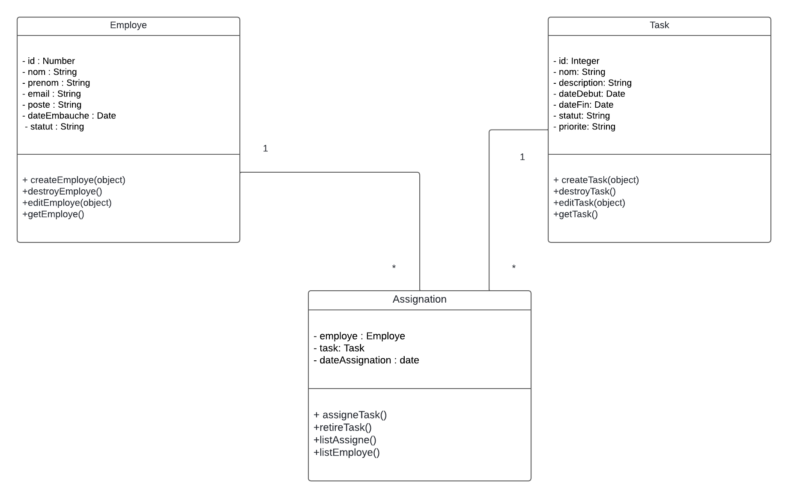

## Prérequis
Avant de commencer, assurez-vous d'avoir installé les éléments suivants :

- `Node.js` (version 12 ou supérieure)
- `Express.js` 
- `Body-parser` 
- `nodemon` 
  
  
   ```express
    npm install express
    ```
  ```body-parser
  npm install body-parser
  ```
   ```nodemon
  npm install nodemon
  ```

## Installation

Suivez ces étapes pour configurer le projet sur votre machine locale :

1. **Clonez le repository :**

    ```bash
    https://github.com/
    ```

2. **Accédez au dossier du projet :**

    ```bash
    cd vue-gestion-tac
    ```

## Utilisation

Pour démarrer l'application, exécutez la commande suivante :

```bash
npm start
```


